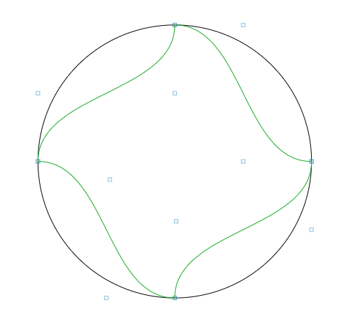

# Plotting boilerplate
For Javascript and canvas with 2d-context.

### Todos
* Convert the current main script into a re-usable and extendable class.

### Changelog
* 2018-10-31
  * Added the Vertex class from an older project.
  * Added the VertexAttr class (not yet in use).
  * Added the VertexListeners class (not yet in use).
  * Added the MouseListener from an older project.
  * Can drag vertices around now.
* 2018-10-23
  * Init.
  

### Dependencies
* HTML5 Canvas
* HTML5 WebGL

### Used Libraries
* dat.gui