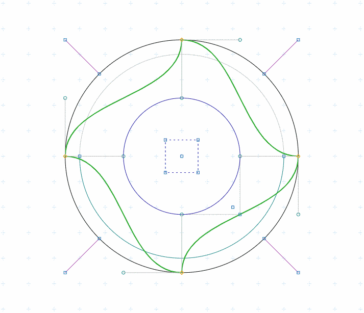
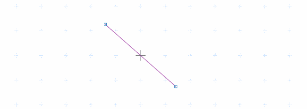

# Plotting boilerplate
For Javascript and canvas with 2d-context.

[Live Demo](https://www.int2byte.de/public/plot-boilerplate/main-dist.html "Live Demo")

Feigenbaum bifurcation (logistic map)

[For a detailed description of this plot see my Feigenbaum-plot mini-project](https://github.com/IkarosKappler/feigenbaum-plot "Feigenbaum bifurcation diagram")

[And here is a tiny article about it](http://www.polygon-berlin.de/deterministisches-chaos "Article about deterministic chaos")

Perpendiducular point-to-line-distance demo

[See the demo](https://www.int2byte.de/public/plot-boilerplate/main-line-point-distance.html "Random-scripture demo")

Random-scripture demo

[See the demo](https://www.int2byte.de/public/plot-boilerplate/main-randomscripture.html "Random-scripture demo")

Vector field test (still in development)

")

[See the demo](https://www.int2byte.de/public/plot-boilerplate/main-vectorfield.html "Demo of the vector field implementation ... still in development")

## Install webpack
This will install the npm-webpack package for you from the package.json file.
~~~~
 $ npm install
~~~~

## Run webpack
This will generate the ./dist/plot-boilerplate.min.js file for you
from the sources code files in ./src/*.
~~~~
 $ npm run webpack
~~~~

## The HTML file
For details see main-dist.html:
~~~~html
    <canvas id="my-canvas">Your browser does not support the canvas tag.</canvas>

    

      [-,-]
    

~~~~

## Initialize the canvas
~~~~javascript
 var pb = new PlotBoilerplate( { canvas                : document.getElementById('my-canvas'),					    
			       	 fullSize              : true,
				 fitToParent           : true,
				 scaleX                : 1.0,
				 scaleY                : 1.0,
				 rasterAdjustFactor    : 2.0,
				 autoAdjustOffset      : true, // was autoCenterOffset before
				 offsetAdjustXPercent  : 50,
				 offsetAdjustYPercent  : 50,
				 defaultCanvasWidth    : 1024,
				 defaultCanvasHeight   : 768,
				 canvasWidthFactor     : 1.0,
				 canvasHeightFactor    : 1.0,
				 cssScaleX	       : 1.0,
				 cssScaleY	       : 1.0,
				 cssUniformScale       : true,
				 rasterGrid            : true,
				 backgroundColor       : '#ffffff',
				 redrawOnResize        : true,
				 drawBezierHandleLines : true,
	    			 drawBezierHandlePoints : true,
				 preDraw               : function() { console.log('before drawing.'); },
				 postDraw              : function() { console.log('after drawing.'); },
				 enableMouse           : true,
				 enableTouch           : true,
		      		 enableKeys            : true
				} );
~~~~					  

## Add elements to your canvas
~~~~javascript
	    // Create two points. The origin is at the visual center by default.
	    var pointA = new Vertex( -100, -100 );
	    var pointB = new Vertex( 100, 100 );
	    pb.add( new Line(pointA,pointB) );

	    // When point A is moved by the user then move point B in the opposite direction
	    pointA.listeners.addDragListener( function(e) {
		pointB.sub( e.params.dragAmount );
		pb.redraw();
	    } );

	    // and when point B is moved then move point A
	    pointB.listeners.addDragListener( function(e) {
		pointA.sub( e.params.dragAmount );
		pb.redraw();
	    } );
~~~~
[And the simple demo is here](https://www.int2byte.de/public/plot-boilerplate/main-simpledemo.html "And the simple demo is here")

## Usage
 * [SHIFT] + [Click] : Select/Deselect vertex
 * [Y] + [Click]: Toggle Bézier auto-adjustment for clicked bézier path point
 * [ALT or CTRL] + [Mousedown] + [Drag] : Pan the area
 * [Mousewheel-up] : Zoom in
 * [Mousewheel-down] : Zoom out

### Todos
 * Make strokes configurable (color, width, style).
 * Implement optional canvas zoom.
 * Implement optional canvas rotation.
 * Make Bézier Curves dividable (by double click?).
 * Implement snap-to-grid.
 * Make ellipses rotatable.
 * Write better viewport/viewbox export. Some viewers do not understand the current format. Refactor BoundingBox2 for this?
 * Add arcs?
 * Add image flipping.
 * Add Images to the SVGBuiler.
 * Move the helper function PlotBoilerplate.utils.buildArrowHead to the Vector class. It belongs there.
 

### Known bugs
 * BezierPath counstructor (from an older implementation) fails. This needs to be refactored.
 * SVG resizing does not work in Firefox (aspect ratio is always kept, even if clip box changes).
 * canvasContext.drawImage(...) with SVG resizing seems not to work in safari and firefox at all. Until there is a solution please use raster images.
 * Currently no more known. Please report bugs.

### Changelog
* 2019-02-23
  * Removed the 'rebuild' function as it had no purpose.
  * Added scaling of the click-/touch-tolerance with the CSS scale.
  * Added the helper function PlotBoilerplate.utils.buildArrowHead(Vertex,Vertex,Number,Number,Number).
  * Added the Vector.toSVGString function, overriding Line.toSVGString.
  * Tweaked the initial vector field demo a little bit (it's really fancy now but still not yet finished).
* 2019-02-20
  * Removed the 'loadFile' entry from the GUI as it was experimental and never in use.
* 2019-02-19
  * Added the Vertex.difference(Vertex) function.
  * Put the TouchHandler back because it is badly coded and rubbish. Used Touchy.js instead.
  * Added two new constants: DEFAULT_CLICK_TOLERANCE and DEFAULT_TOUCH_TOLERANCE. Touch devices have larger tolerance now.
  * Added the second param to the locatePointNear(Vertex,Number) function.
* 2019-02-14
  * Added the console for debugging (setConsole(object)).
* 2019-02-10
  * Fixed a draggable-bug in PBImage handling (scaling was not possible).
  * Added the 'enableTouch' option (default is true).
* 2019-02-06
  * Vertices (instace of Vertex) can now be added using PlotBoilerplate.add(Object).
  * Added the 'draggable' attribute to the vertex attributes.
  * Added the point-to-line distance demo.
* 2019-02-03
  * Removed the drawBackgroundImage() function, with had no purpose at all. Just add an image to the drawables-list.
* 2019-02-02
  *  Added the 'canvasWidthFactor' and 'canvasHeightFactor' params.
* 2019-01-30
  * Fixed the offsetAdjustXPercent and offsetAdjustYPercent bug. They are working properly now.
  * Added the Vector class (subclass of Line).
  * Added the draw.arrow(Vertex,Vertex,color) function for drawing arrow heads.
  * Added the Vertex.setX(Number) and Vertex.setY(Number) functions.
  * Added the PBImage type.
  * Added image rendering.
* 2019-01-14
  * Added params 'drawBezierHandleLines' and 'drawBezierHandlePoints'.
  * Added the 'redraw' param to the add() function.
* 2018-12-30
  * Added the PlotBoilerplate.RectSelector helper for selecting sub
    areas of the current plot without interfering with the current
    plot progress.
* 2018-12-29
  * Renamed the 'autoCenterOffset' param to 'autoAdjustOffset'.
  * Added the params 'offsetAdjustXPercent' and 'offsetAdjustYPercent'.
* 2018-12-29
  * Fixed a bug in the Feigenbaum demo: y was plotted inverted.
* 2018-12-28
  * Removed the unused 'drawLabel' param.
  * Added the 'enableMouse' and 'enableKeys' params.
* 2018-12-21
  * Added the Vertex.inv() function.
  * Fixed the grid offset problem. Grid is now always drawn in visible center.
  * Logarithmic reduction of the grid is now working.
  * Added a small test case for balanced binary search trees.
  * Refactored the redraw() function into several sub-functions for drawing several elements.
* 2018-12-20
  * Fixed a bug in the location-transformation (did not consider the CSS scale yet).
* 2018-12-19
  * Added cssScaling for the canvas. This allows other resolutions than 1:1.
* 2018-12-18
  * Added the config.redrawOnResize param.
  * Added the config.defaultCanvasWidth and config.defaultCanvasHeight params.
  * Fixed the action bugs for the default overlay buttons (OK and cancel had no action assigned).
  * Added a default function for creating a dat.gui interface.
* 2018-12-09
  * Minimal zoom is now 0.01.
  * Added Grid.utils.baseLog(Nnumber,Number) and Grid.utils.mapRasterScale(Number,Number).
  * Bézier control points are not selectable any more.
  * Basic SVG export works now.
  * Added toSVGString to VEllipse class.
  * Added to SVGString to Polygon class.
  * Added a Line class.
  * Changed Bézier control points rendering.
  * Added a demo plot: main-feigenbaum.html.
* 2018-12-06
  * Changed the CTRL key to the ALT key (for panning).
  * Fixed a translate an scale issue in the SVG builder.
  * The constructor's config-param is in use now.
* 2018-12-05
  * Added the Vertex.sub(x,y) function.
  * Added the Line class.
  * Moved the demo code (Line, Polygon, Bezier, Circle) to the index.js file.
  * Expanded the Vertex.add(...) function. Now add(number,number) and add(Vertex) are allowed.
* 2018-12-04
  * Added a simple SVGBuilder.
* 2018-11-30
  * Added the mouse position display.
* 2018-11-28
  * Extended the VertexAttr class (extended the event params by the affected vertex).
  * Added BezierPath.locateCurveBy*Point(Vertex) functions.
  * Added the mousewheel listener to the MouseHandler.
  * Added mousewheel zoom.
  * Added the VEllipse (vertex-ellipse) class and ellipse drawing.
  * Added the Grid class.
  * Added the grid() function to the draw class.
* 2018-11-27
  * Added an attribute model to the VertexAttr class.
  * Changing bezier path points with holding down 'y'+click is now possible (bezier-autoadjust).
  * Added a new function to the draw class: diamondHandle.
* 2018-11-20
  * Bézier curve does now auto adjust when dragging path points and control points.
  * BezierPath implementation now support circular paths.
  * Fixed some issues in the dat.gui interface configuration. Axis independent scaling works now.
* 2018-11-19
  * Re-animated the CubicBezierCurve class and the BezierPath class.
  * Added multi-select and multi-drag option.
  * Made elements selectable (with holding SHIFT).
  * Added panning (move the canvas origin by pressing CTRL and drag).
  * Implemented zoom into dat.gui interface.
* 2018-11-17
  * Added the Polygon class.
  * Added npm/webpack for compiling and code minification.
* 2018-11-11
  * Added a simple KeyHandler for receiving key events.
* 2018-11-10
  * Renamed the js/ direcotory to src/.
* 2018-11-09
  * Refactored the main script to a class.
* 2018-10-31
  * Added the Vertex class from an older project.
  * Added the VertexAttr class (not yet in use).
  * Added the VertexListeners class (not yet in use).
  * Added the MouseListener from an older project.
  * Can drag vertices around now.
* 2018-10-23
  * Init.
  

### Dependencies
* HTML5 Canvas

### Used Libraries
* dat.gui
* Color.js
* FileSaver.js
* SGV-arcto to Canvas-arc transform from https://github.com/canvg/canvg by Gabe Lerner
* Touchy.js by jairajs89. https://github.com/jairajs89/Touchy.js
   