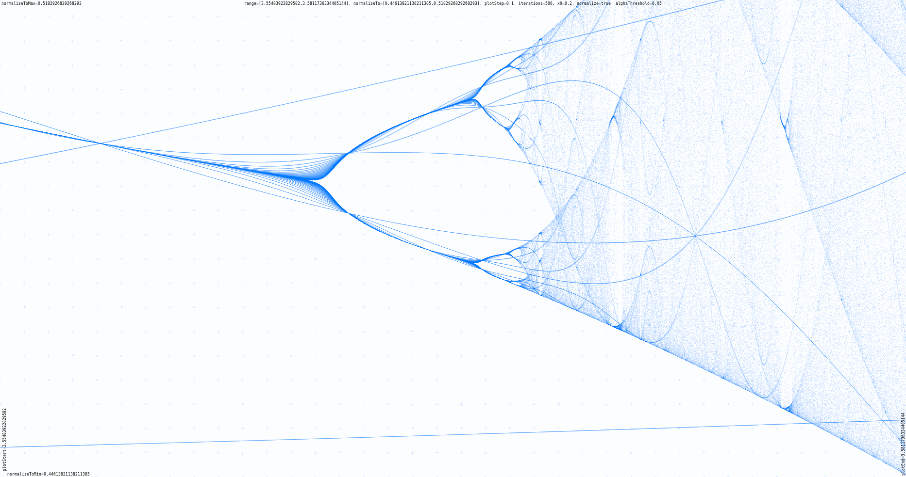
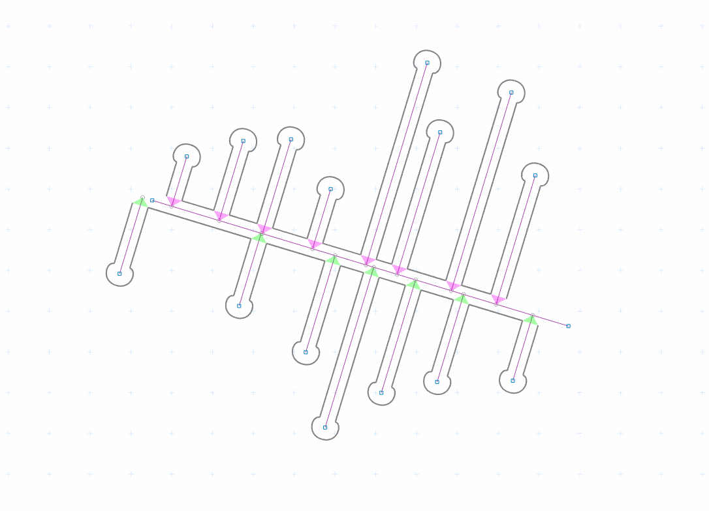
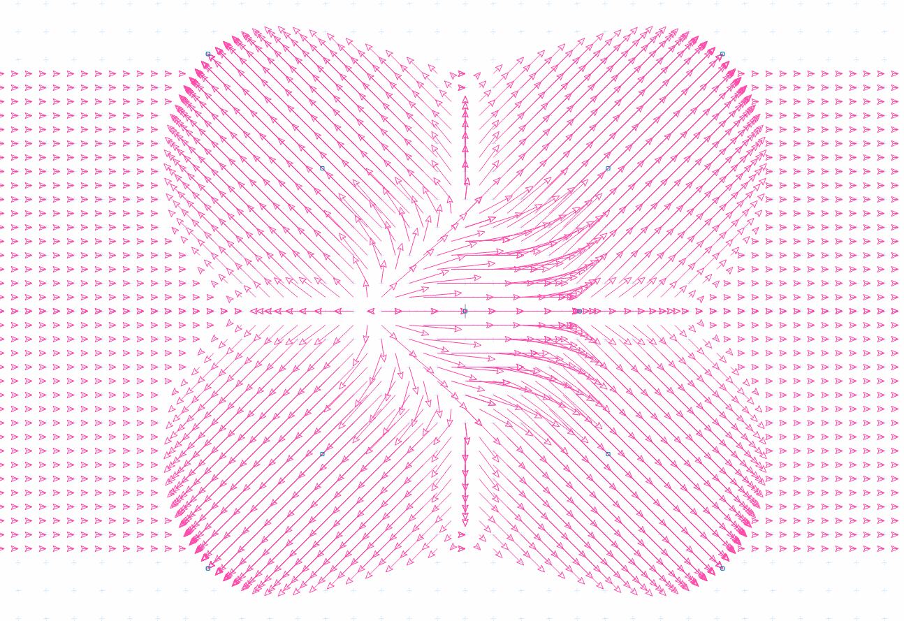
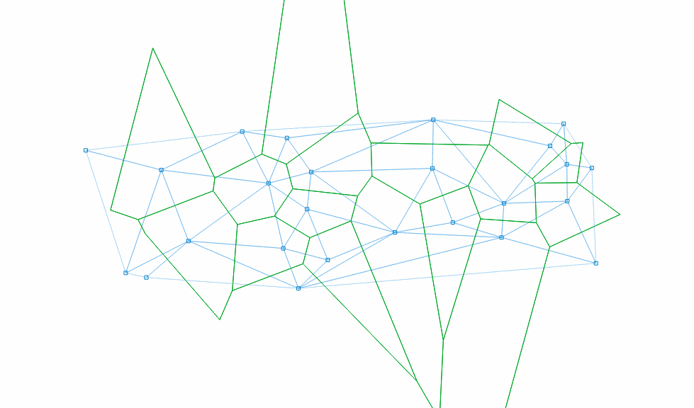
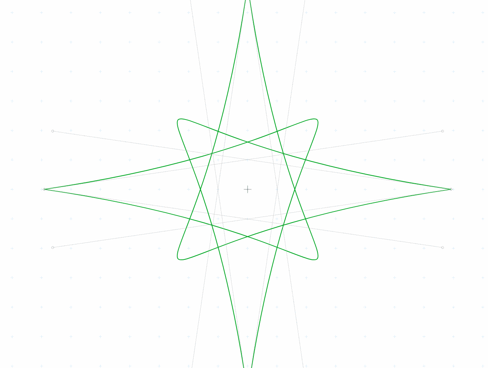

# An interactive Javascript Plotting Boilerplate
For plotting visual 2D data with Javascript and canvas (in 2d-context).

This is a simple collection of useful functions I repetitively used for
visualizing 2D geometries on HTML canvas. Basic features are
 * adding elements like vertices, lines, vectors, triangles, curves, polygons, ellipses, images
 * cofiguration of the canvas behavior (fullsize, interaction, raster)
 * mouse interaction (zoom, pan, drag elements)
 * keyboard interaction
 * touch interaction for dragging vertices (desktop and mobile)
 

## Install the package via npm
~~~sh
   $ npm i -g npm          # Updates your npm if necessary
   $ npm i plotboilerplate # Installs the package
~~~

## The HTML file
For a full example see main-dist.html:
~~~html
   <canvas id="my-canvas">
      Your browser does not support the canvas tag.
   </canvas>

   <!-- Optional: a helper to display mouse/touch position -->
   

      [-,-]
   

~~~
The 'info' block is just for displaying the current mouse/touch coordinates.

## The javascript
~~~javascript
   var pb = new PlotBoilerplate( {
       canvas		: document.getElementById('my-canvas'),
       fullSize         : true
    } );
~~~

## Add elements to your canvas
~~~javascript
   // Create two points:
   //   The origin is at the visual center by default.
   var pointA = new Vertex( -100, -100 );
   var pointB = new Vertex( 100, 100 );
   pb.add( new Line(pointA,pointB) );

   // When point A is moved by the user
   //   then move point B in the opposite direction
   pointA.listeners.addDragListener( function(e) {
   	pointB.sub( e.params.dragAmount );
	pb.redraw();
   } );
   
   // and when point B is moved
   //   then move point A
   pointB.listeners.addDragListener( function(e) {
   	pointA.sub( e.params.dragAmount );
	pb.redraw();
   } );
~~~
<a class="btn btn-link" href="https://plotboilerplate.io/repo/demos/00-simple/index.html" title="And the simple demo is here">And the simple demo is here</a>

## Examples and screenshots

<a class="btn btn-link" href="https://plotboilerplate.io/repo/main-dist.html" title="See the demo">See the demo</a>

### Feigenbaum bifurcation (logistic map)

[For a detailed description of this plot see my Feigenbaum-plot mini-project](https://github.com/IkarosKappler/feigenbaum-plot "Feigenbaum bifurcation diagram")

<a class="btn btn-link" href="https://plotboilerplate.io/repo/demos/06-feigenbaum/index.html" title="See the demo">See the demo</a>

[And here is a tiny article about it](http://www.polygon-berlin.de/deterministisches-chaos "Article about deterministic chaos")

### Perpendiducular point-to-line-distance demo

<a class="btn btn-link" href="https://plotboilerplate.io/repo/demos/02-line-point-distance/index.html" title="See the demo">See the demo</a>

#### This second demo draws 'bark beetle tunnels' 

<a class="btn btn-link" href="https://plotboilerplate.io/repo/demos/02-line-point-distance/index.html?backgroundColor=#fff&showBarkBeetleTunnels=true&pointCount=15" title="See the demo">See the demo</a>

### Random-scripture demo

<a class="btn btn-link" href="https://plotboilerplate.io/repo/demos/03-random-scripture/index.html" title="See the demo">See the demo</a>

### Vector field test 

<a class="btn btn-link" href="https://plotboilerplate.io/repo/demos/04-vectorfield/index.html" title="See the demo">See the demo</a>

### Simple circumcircles of walking triangles animation

 animation")

<a class="btn btn-link" href="https://plotboilerplate.io/repo/demos/05-circumcircle-animation/index.html" title="See the demo">See the demo</a>

### Interactive Delaunay triangulation and Voronoi diagram

<a class="btn btn-link" href="https://plotboilerplate.io/repo/demos/07-voronoi-and-delaunay/index.html" title="See the demo">See the demo</a>

### Walking triangle demo

<a class="btn btn-link" href="https://plotboilerplate.io/repo/demos/08-walking-triangles/index.html" title="See the demo">See the demo</a>

### Simple tweening animation using the GSAP library

<a class="btn btn-link" href="https://plotboilerplate.io/repo/demos/10-bezier-animation-gsap/index.html" title="See the demo">See the demo</a>

### Perpendiculars of a Bézier path

<a class="btn btn-link" href="https://plotboilerplate.io/repo/demos/11-bezier-perpendiculars/index.html" title="See the demo">See the demo</a>

### Tracing a cubic Bézier spline (finding the tangent values for each vertex)

<a class="btn btn-link" href="https://plotboilerplate.io/repo/demos/12-trace-bspline/index.html" title="See the demo">See the demo</a>

## Initialization parameters
| Name | Type | Default | Description |
|---|---|---|---|
| `canvas`| _HTMLCamvasElement_ | `null` | The canvas (must not be null). |
| `fullsize | _boolean_ | `true`| If `true`, then the canvas will always claim tha max available screen size. |
| `fitToParent`| _boolean_ | `true`| If `true`, then the canvas will alway claim the max available parent container size. |
| `scaleX`| _number_ | `1.0` | The initial horizontal zoom. Default is 1.0. |
| `scaleY`| _number_ | `1.0` | The initial vertical zoom. Default is 1.0. |
| `offsetX`| _number_ | `0.0` | The initial offset. Default is 0.0. Note that autoAdjustOffset=true overrides these values. |
| `offsetY`| _number_ | `0.0`| The initial offset. Default is 0.0. Note that autoAdjustOffset=true overrides these values. |
| `drawGrid`| _boolean_ | `true` |  Specifies if the raster should be drawn. |
| `rasterGrid`| _boolean_ | `true` | If set to true the background grid will be drawn rastered. |
| `rasterAdjustFactor`| _number_ | `2.0` | The exponential limit for wrapping down the grid. (2.0 means: halve the grid each 2.0*n zoom step). |
| `drawOrigin`| _boolean_ | `false` | Draw a crosshair at (0,0). |
| `autoAdjustOffset`| _boolean_ | `true` | When set to true then the origin of the XY plane will be re-adjusted automatically (see the params offsetAdjust{X,Y}Percent for more). |
| `offsetAdjustXPercent`| _number_ | `50` | The x- and y- fallback position for the origin after resizing the canvas. |
| `offsetAdjustYPercent`| _number_ | `50` | The x- and y- fallback position for the origin after resizing the canvas. |
| `defaultCanvasWidth`| _number_ | `1024`| The canvas size fallback if no automatic resizing is switched on. |
| `defaultCanvasHeight`| _number_ | `768` | The canvas size fallback if no automatic resizing is switched on. |
| `canvasWidthFactor`| _number_ | `1.0` | Two scaling factors (width and height) upon the canvas size. In combination with cssScale{X,Y} this can be used to obtain sub pixel resolutions for retina displays. |
| `canvasHeightFactor`| _number_ | `1.0` | Two scaling factors (width and height) upon the canvas size. In combination with cssScale{X,Y} this can be used to obtain sub pixel resolutions for retina displays. |
| `cssScaleX`| _number_ | `1.0` | Visually resize the canvas using CSS transforms (scale x). |
| `cssScaleY`| _number_ | `1.0` | Visually resize the canvas using CSS transforms (scale y). |
| `cssUniformScale`| _boolean_ | `1.0` |  If set to true only cssScaleX applies for both dimensions. |
| `backgroundColor`| _string_ | `#ffffff` | A background color (CSS string) for the canvas. |
| `redrawOnResize`| _boolean_ | `true` | Switch auto-redrawing on resize on/off (some applications might want to prevent automatic redrawing to avoid data loss from the drae buffer).|
| `drawBezierHandleLines`| _boolean_ | `true` | Indicates if Bézier curve handle points should be drawn. |
| `drawBezierHandlePoints`| _boolean_ | `true` | Indicates if Bézier curve handle points should be drawn. |
| `preClear`| _function_ | `null` | A callback function that will be triggered just before the draw function clears the canvas (before anything else was drawn).|
| `preDraw`| _function_| `null` | A callback function that will be triggered just before the draw function starts. |
| `postDraw`| _function_| `null` | A callback function that will be triggered right after the drawing process finished.|
| `enableMouse`| _boolean_ | `true` | Indicates if the application should handle touch events for you. |
| `enableTouch`| _boolean_ | `true` | Indicates if the application should handle touch events for you. |
| `enableKeys`| _boolean_ | `true` | Indicates if the application should handle key events for you. |
| `enableMouseWheel`| _boolean_ | `true` | Indicates if the application should handle mouse wheelevents for you. |
| `enableGL`| _boolean_ | `false` | [Experimental] Indicates if the application should use the experimental WebGL features. |

~~~javascript
 var pb = new PlotBoilerplate( {
  // HTMLElement
  //   Your canvas element in the DOM (required).
  canvas			: document.getElementById('my-canvas'),

  // boolean
  //   If set to true the canvas will gain full window size.
  fullSize              	: true,

  // boolean
  //   If set to true the canvas will gain the size of its parent
  //   container.
  // @overrides fullSize
  fitToParent           	: true,

  // float
  //   The initial zoom. Default is 1.0.
  scaleX                	: 1.0,
  scaleY                	: 1.0,

  // float
  //   The initial offset. Default is 0.0. Note that autoAdjustOffset=true overrides these values.
  offsetX                	: 0.0,
  offsetY                	: 0.0,

  // Specifies if the raster should be drawn.
  drawGrid                : true,

  // If set to true the background grid will be drawn rastered.
  rasterGrid              : true,

  // float
  //    The exponential limit for wrapping down the grid.
  //    (2.0 means: halve the grid each 2.0*n zoom step).
  rasterAdjustFactor    	: 2.0,

  // Draw a crosshair at (0,0).
  drawOrigin              : false,

  // boolean
  //   When set to true then the origin of the XY plane will
  //   be re-adjusted automatically (see the params
  //    offsetAdjust{X,Y}Percent for more).
  autoAdjustOffset      	: true,
  // float
  //   The x- and y- fallback position for the origin after
  //   resizing the canvas.
  offsetAdjustXPercent  	: 50,
  offsetAdjustYPercent  	: 50,

  // int
  //   The canvas size fallback if no automatic resizing
  //   is switched on.
  defaultCanvasWidth    	: 1024,
  defaultCanvasHeight   	: 768,

  // float
  //   Two scaling factors (width and height) upon the canvas size.
  //   In combination with cssScale{X,Y} this can be used to obtain
  //   sub pixel resolutions for retina displays.
  canvasWidthFactor     	: 1.0,
  canvasHeightFactor    	: 1.0,

  // float
  //   Visually resize the canvas using CSS transforms (scale).
  cssScaleX	       	: 1.0,
  cssScaleY	       	: 1.0,

  // boolean
  //   If set to true only cssScaleX applies for both dimensions.
  cssUniformScale         : true,

  // string
  //   A background color (CSS string) for the canvas.
  backgroundColor       	: '#ffffff',

  // boolean
  //   Switch auto-redrawing on resize on/off (some applications
  //   might want to prevent automatic redrawing to avoid data
  //   loss from the drae buffer).
  redrawOnResize        	: true,

  // boolean
  //   Indicates if Bézier curve handles should be drawn (used for
  //   editors, no required in pure visualizations).
  drawBezierHandleLines 	: true,

  // boolean
  //   Indicates if Bézier curve handle points should be drawn.
  drawBezierHandlePoints 	: true,

  // function
  //   A callback function that will be triggered just before the
  //   draw function clears the canvas (before anything else was drawn).
  preClear              	: function() { console.log('before clearing the canvas on redraw.'); },
	
  // function
  //   A callback function that will be triggered just before the
  //   draw function starts.
  preDraw               	: function() { console.log('before clearing and before drawing.'); },

  // function
  //   A callback function that will be triggered right after the
  //   drawing process finished.
  postDraw              	: function() { console.log('after drawing.'); },

  // boolean
  //   Indicates if the application should handle mouse events for you.

  enableMouse           	: true,
  // boolean
  //   Indicates if the application should handle touch events for you.
  enableTouch           	: true,

  // boolean
  //   Indicates if the application should handle key events for you.
  enableKeys            	: true,

  // boolean
  //   Indicates if the application should handle mouse wheelevents for you.
  enableMouseWheel            : true,

  // boolean
  //   Indicates if the application should use the experimental WebGL features.
  enableGL                    : false
 } );
~~~					  

## Events
The Vertex class has basic drag event support:
~~~javascript
 var vert = new Vertex(100,100);
 vert.listeners.addDragListener( function(e) {
   // e is of type Event.
   // You are encouraged to use the values in the object e.params
   console.log( 'vertex was dragged by: ',
   	        'x='+e.params.dragAmount.x,
	        'y='+e.params.dragAmount.y );
 } );
~~~

### The e.params object
~~~javascript
 {
  // The canvas that fired the event.
  element : [HTMLElement],
    
  // The event name.
  //   Default: 'drag'
  name : string,

  // The current drag position.
  pos : { x : Number, y : Number },

  // A mouse button indicator (if mouse event).
  //    0=left, 1=middle, 2=right
  button : Number,

  // A flag indicating if event comes from left mouse button.
  leftButton : boolean,

  // A flag indicating if event comes from middle mouse button.
  middleButton : boolean,

  // A flag indicating if event comes from right mouse button.
  rightButton : boolean,

  // A mouse-down-position: position where the dragging
  //   started. This will not change during one drag process.
  mouseDownPos : { x : Number, y : Number },

  // The most recent drag position (position before
  //   current drag step).
  draggedFrom : { x : Number, y : Number },

  // True if this is a drag event (nothing else possible at the moment).
  wasDragged : boolean,

  // The x-y-amount of the current drag step.
  //   This is the difference between the recent drag step
  //   and the actual drag position.
  dragAmount : { x : Number, y : Number }
 }
~~~

## Usage
 * [SHIFT] + [Click] : Select/Deselect vertex
 * [Y] + [Click]: Toggle Bézier auto-adjustment for clicked bézier path point
 * [ALT or CTRL] + [Mousedown] + [Drag] : Pan the area
 * [Mousewheel-up] : Zoom in
 * [Mousewheel-down] : Zoom out

## Re-compile the package

The package is compiled with webpack. See the webpack.config.js file.

### Install webpack
This will install the npm-webpack package with the required dependencies
for you from the package.json file.
~~~bash
 $ npm install
~~~

### Run webpack
This will generate the ./dist/plotboilerplate.min.js file for you
from the sources code files in ./src/*.
~~~bash
 $ npm run webpack
~~~

## Todos
 * Use a sorted map in the line-point-distance demo.
 * The experimental WebGL support requires Color objects instead of color strings. Otherwise each color string will be parse on each roundtrip which is a nightmare for the performance.
 * The Color.parse(string) function does only recognize HEX, RGB and RGBA strings. HSL is still missing. Required?
 * Include Touchy.js as a package dependency.
 * Include FileSaver.js as a package dependency.
 * Measure the canvas' border when applying fitToParent! Currently a 1px border is expected.
 * Make strokes configurable (color, width, style).
 * Make Bézier Curves dividable (by double click?).
 * Implement snap-to-grid.
 * Make ellipses rotatable.
 * Write better viewport/viewbox export. Some viewers do not understand the current format. Refactor BoundingBox2 for this?
 * The PlotBoilerplate.viewport() function already returns a bounding box (min:{Vertex},max:{Vertex}).
 * Add arcs?
 * Add image flipping.
 * Add Images to the SVGBuiler.
 * Move the helper function PlotBoilerplate.utils.buildArrowHead to the Vector class. It belongs there.
 * Add image/svg support (adding SVG images).
 * Add a proper webpack entry point file (like index.js or entry.js?).
 * Add typescript and define an interface for drawables (Drawable.ts?).
 * Add a vertex attribute: visible. (to hide vertices).
 * Add control button: reset zoom.
 * Add control button: reset to origin.
 * [Partially done] Add control button: set to retina resolution (size factors and css scale).
 * Add a demo that draws a proper mathematical xy-grid.
 * Switching browser tabs back and forth sometimes locks the Ctrl-Key. Check that.
 * [NPM/Bash] Add a pre-publish check if there are unstaged changes.
 * [Readme] Add params as table.
 * The intersection points in the line-point-distance demo are draggable. Why?
 * Move the helper function triangle.pointIsInTriangle()...pointIsInTriangle() should be in a utils wrapper somewhere.
 * Add a demo: Lissajous-Curves (direct and Bézier approximation).

## Todos for future Version 2 (not backwards compatible)
 * Change the Vector.inverse() function to reverse (or something). Currently this is not what the inverse of a vector should be.
 * Change the bezier point path order from [start,end,startContro,endControl] to [start,startControl,endControl,end].

## Browsers support

|  IE / Edge |  Firefox |  Chrome |  iOS Safari |
| --------- | --------- | --------- | --------- |
| IE11 & Edge| latest    | latest    | latest    |
  

### Used Libraries
* dat.gui
* Color.js
* FileSaver.js
* [Touchy.js](https://github.com/jairajs89/Touchy.js "Touchy.js") by [jairajs89](https://github.com/jairajs89 "jairajs89") 

## Known bugs
 * BezierPath counstructor (from an older implementation) fails. This needs to be refactored.
 * SVG resizing does not work in Firefox (aspect ratio is always kept, even if clip box changes). Please use PNGs until this is fixed.
 * The BBTree.iterator() fails if the tree is empty! (Demos)
 * The minifid BBTree and BBTreeCollection files do not export anything. The un-minified to. Why that?
 * Currently no more known. Please report bugs.

