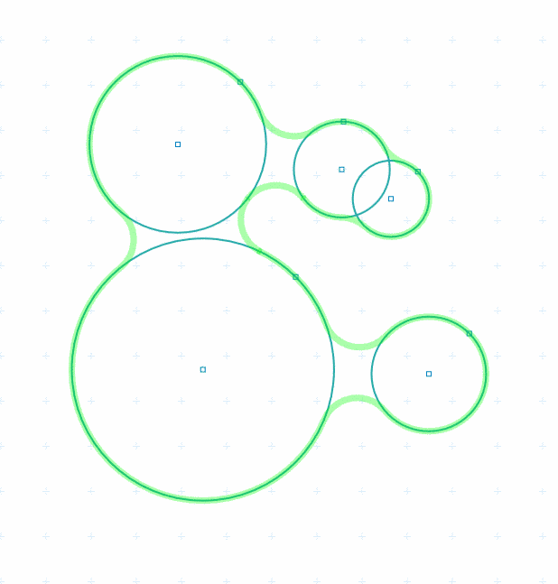

# Meta Balls 2D

In computer graphics, metaballs, also known as blobby objects, are organic-looking n-dimensional isosurfaces, characterised by their ability to meld together when in close proximity to create single, contiguous objects. ([Wikipedia](https://en.wikipedia.org/wiki/Metaballs))

[Article by John Wigg](https://john-wigg.dev/2DMetaballs/)
