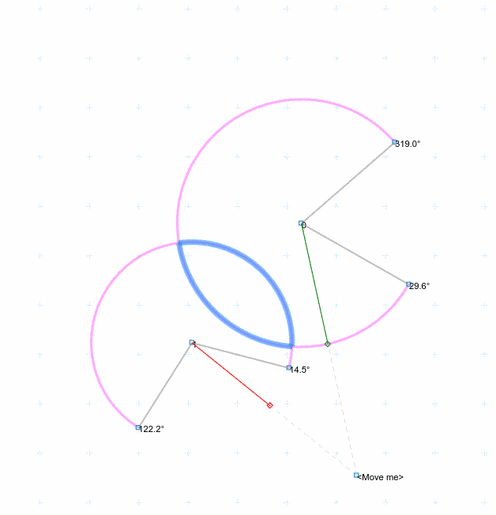

# Circle Sector Intersections

In distiction to circle the _cicle sector_ intersects a bit differently with other circle sectors. Thinking of circle sectors as path segments (with start and end point) two sectors _have a non-empty intersection_ if

- both intersecion points of the [radical line] are located on each segment
- the connecting path segments have no gaps

[radical line]: https://en.wikipedia.org/wiki/Radical_axis
