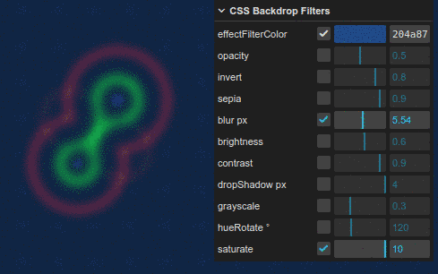

# After effects filter (with metaballs 2d demo)

Since CSS3 it's possible to apply effect filters to existing graphics. This approach adds a 'filter-layer' onto the canvas and uses it's CSS properties to modify the appearance of the canvas output ([mdn web docs](https://developer.mozilla.org/en-US/docs/Web/CSS/backdrop-filter))

[mdn web docs: backdrop-filter](https://developer.mozilla.org/en-US/docs/Web/CSS/backdrop-filter)
