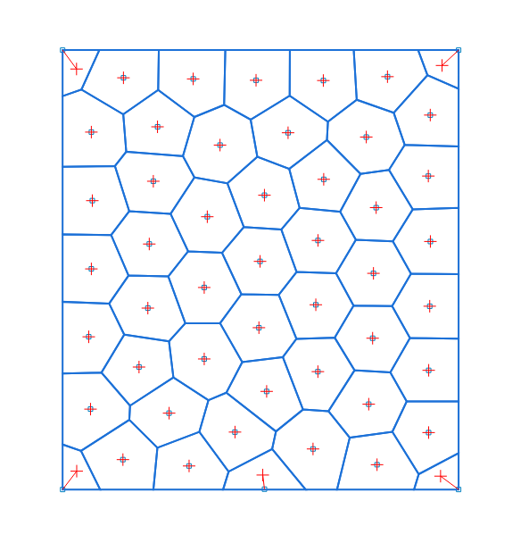

# Lloyd's algorithm for relaxing Voronoi diagrams

[Lloyd's algorithm on Wikipedia](https://en.wikipedia.org/wiki/Lloyd%27s_algorithm)

[Example from bitbanging.space](https://www.bitbanging.space/posts/lloyds-algorithm)

